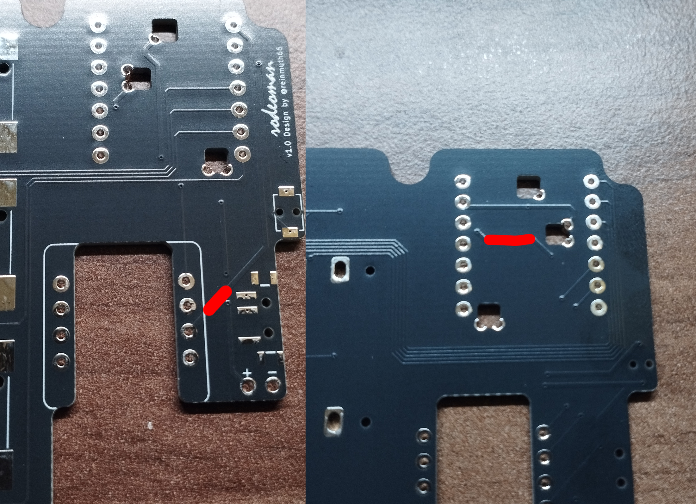
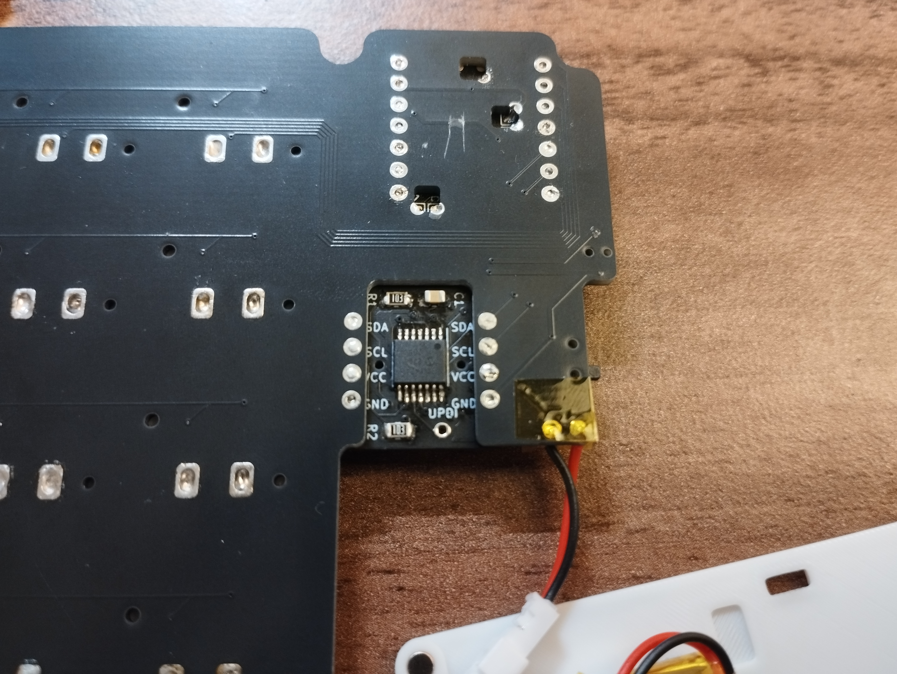
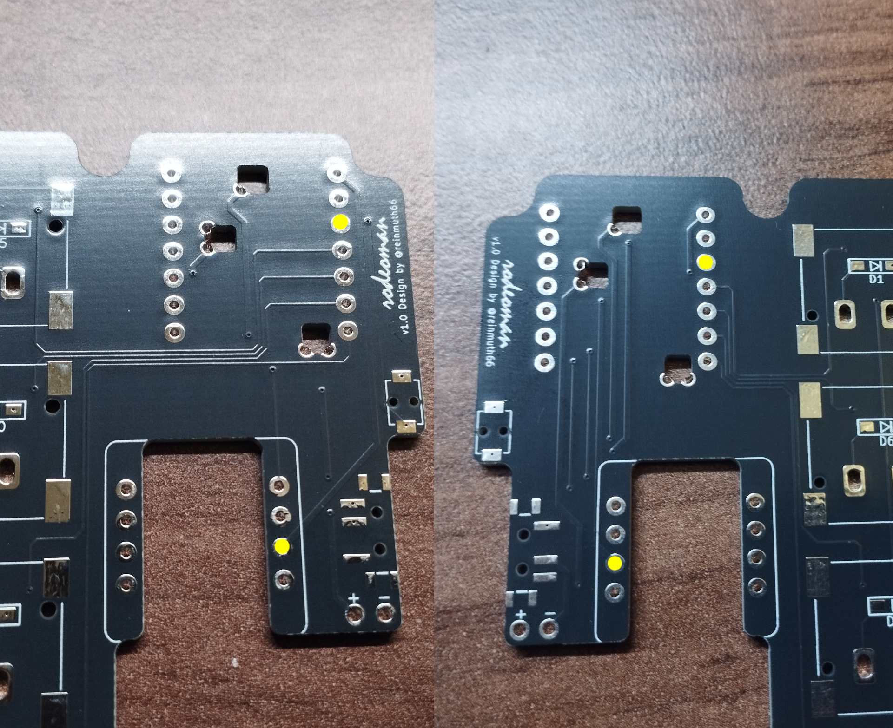

# buildguide_v1

## 必要なパーツリスト

| 名前 | 数 | 備考 |
| :--- | ---: | :--- |
| [Seeed XIAO BLE nRF52840](https://akizukidenshi.com/catalog/g/g117341/) | 2 |  |
| [AZ1UBALL](https://booth.pm/ja/items/4202085) | 2 |  |
| Kailh PG1316S | 40 | 予備で+5個ほど買っておくと安心 |
| Kailh PG1316S Keycaps | 40 | 3DPなどで自作して代替でも良い |
| 1N4148W | 40 | ダイオード |
| [TVAF06-A020B-R](https://akizukidenshi.com/catalog/g/g114888/) | 2 | リセットスイッチ |
| [MSK12C02](https://ja.aliexpress.com/item/4000685483225.html) | 2 | 電源スイッチ |
| [丸形ネオジム磁石](https://www.hiqparts.com/item/4582370700637.html) | 24 | 直径2.5mm x 高さ1.5mm |
| [リポバッテリー](https://www.amazon.co.jp/OCTelect-3-7V%E3%83%90%E3%83%83%E3%83%86%E3%83%AA%E3%83%BC402020%E3%83%90%E3%83%83%E3%83%86%E3%83%AA%E3%83%BC401818%E3%83%90%E3%83%83%E3%83%86%E3%83%AA%E3%83%BC120mAh%E7%BE%8E%E5%AE%B9%E3%82%A2%E3%82%A4%E3%83%A1%E3%83%BC%E3%82%BF%E3%83%BC%E5%85%85%E9%9B%BB%E5%BC%8F%E3%83%90%E3%83%83%E3%83%86%E3%83%AA%E3%83%BC/dp/B0856QN7XG/ref=rvi_d_sccl_1/358-3197442-4003258?pd_rd_w=YTP1d&content-id=amzn1.sym.a4dc92d7-7100-437e-b3e3-2349e8298523&pf_rd_p=a4dc92d7-7100-437e-b3e3-2349e8298523&pf_rd_r=2PA9Z4V37BWEYYZYYFVN&pd_rd_wg=213DT&pd_rd_r=a46fde64-9a26-41df-a496-8bc438fa2c20&pd_rd_i=B0856QN7XG&psc=1) | 2 | 402020サイズ 120mAh |
| [バッテリーコネクタケーブル](https://www.amazon.co.jp/dp/B0FJK99XXL?ref=cm_sw_r_cso_li_apan_dp_43GFVHEYMN54RB8F37S0&ref_=cm_sw_r_cso_li_apan_dp_43GFVHEYMN54RB8F37S0&social_share=cm_sw_r_cso_li_apan_dp_43GFVHEYMN54RB8F37S0&openExternalBrowser=1) | 2 | リンクのリポバッテリーを買う場合、JST 1.25mmピッチ 2ピンのコネクタケーブルが必要 |
| 空中配線用ケーブル | 2 | 私はコネクタケーブルを買った時にオス側もついてきたのでそちらの線を使用 |

ケース内のバッテリースペースの内寸(幅x奥行きx高さ)はデータ上 24.5mm x 23.5mm x 6.8mm ですが、同じスペースにコネクタケーブルも収納しないといけないことを考慮してバッテリーを選んでください。私はリンクのバッテリーを使っています。

## はんだ付け手順

写真の赤丸で囲った部分とその番号が以下の手順と対応しています。

はんだ付け工程において、基板の裏面からなるべくはんだを飛び出させないようにしてください。ボトムケースと干渉し基板が浮いてしまい、組み立てがうまくいかない可能性があります。

1. **パターンカット**
  左側の基板は表側の赤線、右側の基板は裏側の赤線の一部をカッターナイフなどで削り取るようにパターンカットしてください。
  

2. **ダイオード**
  向きに気をつけてください。後からキースイッチが覆いかぶさるので、この時点で導通確認を行わないと後悔します。

3. **Kailh PG1316S**
  ここが1番の難所です。1パーツあたりのはんだ付け箇所が多いかつ導通確認が大変です。この試練を乗り越えれば、自分ならどんなはんだ付けでもできるんだという気持ちになれます。詳しいはんだ方法は[パレットシステムさん制作のazcardのビルドガイド](https://github.com/palette-system/azcard/tree/main/docs/buildguide)をご覧ください。
  やってみるとわかるのですが、なかなか裏のはんだ箇所がスイッチの方まで流れていきません。自分なりのコツは、はんだ線を基盤の穴の奥まで挿して溶かすとうまく行きやすいです。それでも導通しない場合には、表の4つのはんだ固定によりスイッチと基板の隙間が完全に無いものと信じ、溶かしたはんだが冷えるのを待ってから、はんだごてではんだを押し込むような操作を何回かすると良いです。もし短絡させてしまったら、ホットプレートでスイッチを外してください。そのスイッチは使わないほうが吉です。
  ただ、基盤の穴を工夫すればはんだが流れやすくなるのではないかと考えているので、ここは改善の余地があります。

4. **XIAO BLE nRF52840**
  基板の裏側にバッテリー用・リセットスイッチ用のはんだ箇所もあるので忘れないように。

5. **AZ1UBALL基板**
  XIAO BLE nRF52840と同じ要領ではんだ付けをしましょう。AZ1UBALL基板の向きは写真の通りです。ちょっと分かりづらいのでここも改善の余地がありますね。
  

6. **空中配線**
  左側・右側それぞれで黄色の箇所を配線するようにしてください。XIAO基板とAZ1UBALL基板にはんだで埋まっている穴があると思うのでその穴に線の先を埋まらせるイメージではんだ付けしましょう。
  

7. **リセットスイッチ**
  基盤の穴にスイッチの裏の突起が嵌まるようにしましょう。

8. **電源スイッチ**
  はんだが別のはんだ箇所にはみ出さないように気をつけましょう。

9. **バッテリーコネクタケーブル**
  基板表からケーブルの先を挿して裏からはんだ付けをしましょう。

## 完成イメージ

電源スイッチのON, OFFの向きは写真の通りです。

## ケースについて

写真のように穴にマグネットを入れて接着剤等で固定してください。トップケースとボトムケースがくっつくように磁石の向きに気をつけてください。左右間でも意識すると、キーボードの裏面同士がくっつくようになります。写真は右側のケースです。

## ファームウェアを書き込んでから困ったこと

キースイッチはんだ付けの時に導通確認を行ったのに、ファームウェアを書き込んでからキースイッチが反応するか確認をすると、反応しないキーがあるというような事象が、少なくとも私の購入したスイッチでは発生しました(XIAO基板とキーボード基板のはんだ付けが正しく行えている前提です)。この場合における解決策として私が行ったことが3つあります。
1. キースイッチを何回か軽く叩くように押す。
2. 再度、該当箇所のキーボード基板とキースイッチのはんだ付けを行う。
3. そもそもキースイッチが不良品であるため、キースイッチを入れ替える。
1で解決できるのが最も楽です。2も二度手間で済むのでまだ良いです。問題は3です。キースイッチの場所によっては、ホットプレートで外す時に他のキースイッチやパーツに影響が出ます。じゃあ、キースイッチをはんだ付けする前にキースイッチそのものの導通確認をすれば良いんじゃないかと思った方もいるかもしれません。もちろんその行為に意味が無いことは無いです。しかし、私が不良品だと思って外したキースイッチそのものに対して導通確認をすると普通に導通しました。原因はよくわかりませんが、こういう可能性もあることを頭に入れておいてほしいです。なので、ダイオードの導通確認は確実に行っておいたほうが幸せになれます。ここにダイオードの可能性が絡んでくると、とんでもないことが起きます。
また、これらのことからキーキャップをつけるのは本当に最後の最後にしたほうが良いです。前提としてキーキャップは公式の仕様的に一度付けると取り外せないことになっています。キースイッチを外すことになった時にホットプレートで外そうとするとキースイッチに熱が伝わるため、もしキーキャップを付けてしまっているとキーキャップが溶ける可能性があります。
